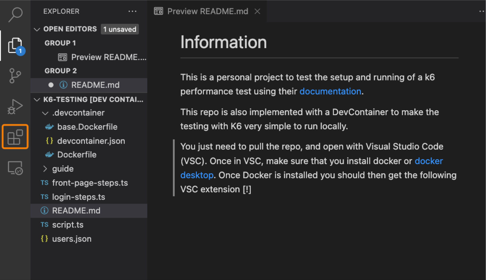
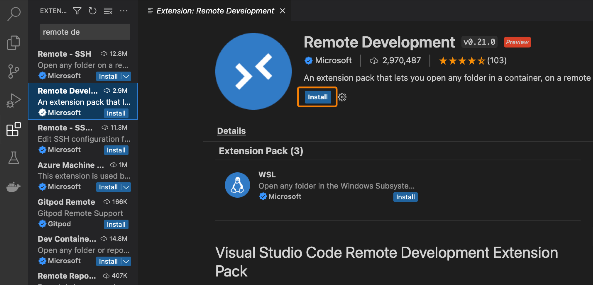
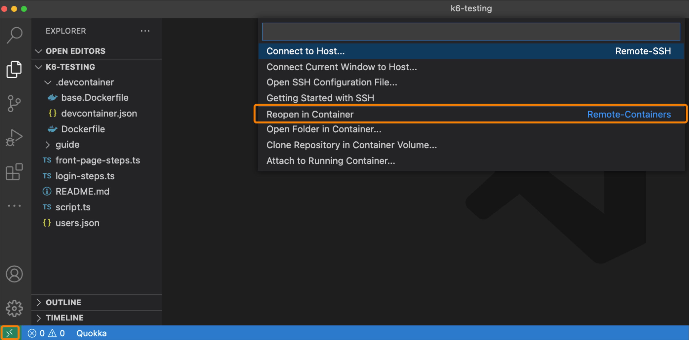

# Information

This is a personal project to test the setup and running of a k6 performance tests using their [documentation](https://test.k6.io/).

This repo is also implemented with a DevContainer to make the testing with K6 very simple to run locally.

## Running with a Dev Container

You just need to pull the repo, and open with Visual Studio Code (VSC). Once in VSC, make sure that you install docker or [docker desktop](https://www.docker.com/products/docker-desktop/). Once Docker is installed you should then get the following VSC extension

Navigate to the Extensions section of VSC


Search for "Remote Development", you should find an extension pack with 3 extensions bundled within. Click to install


Once installed click the new green symbol in the bottom left of your VSC window and then select Reopen in container


Once the container has started, you can open a terminal window and type

```
k6 run script.ts
```

This will begin the k6 test run.